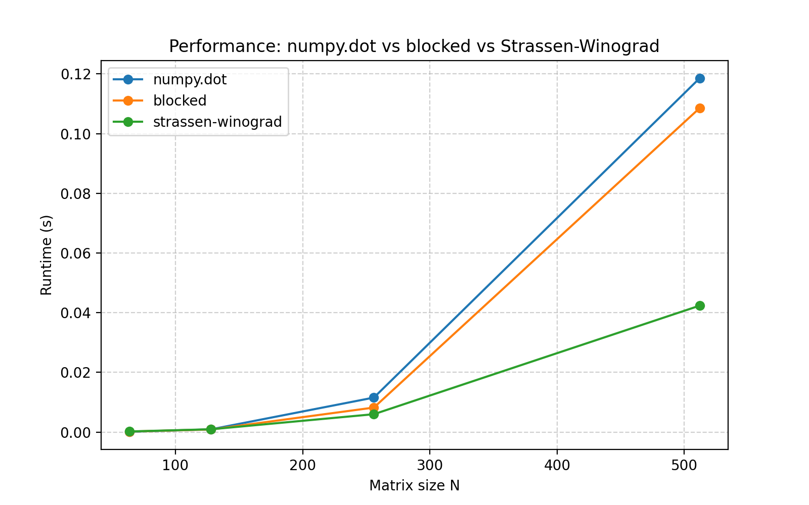
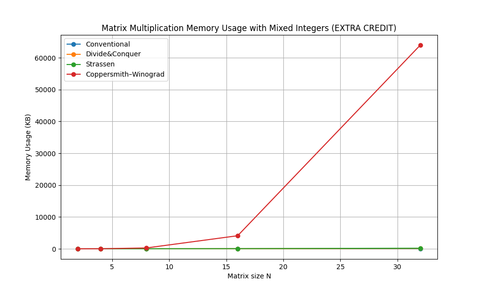
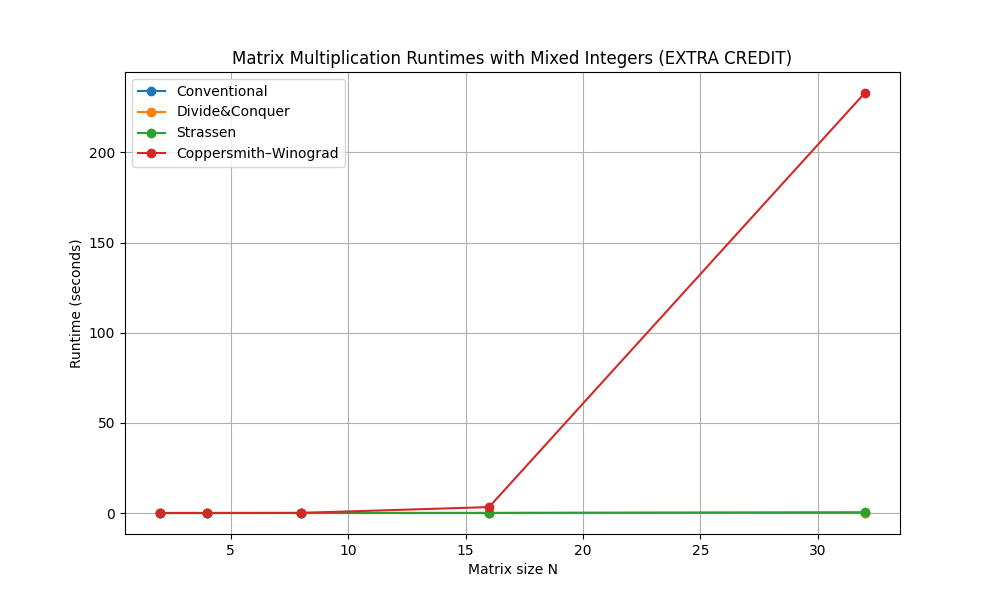

## Goals:

The goal of this assignment is to explore, implement, and compare multiple approaches to matrix multiplication. By examining the conventional algorithm, the divide and conquer method, Strassen’s algorithm, and a simplified Coppersmith–Winograd approach, the study aims to highlight how algorithmic design influences performance. The experiments are intended to measure differences in runtime, memory usage, and efficiency when varying matrix sizes and the type of integer entries. This analysis helps in building an understanding of how theoretical improvements in asymptotic complexity translate into practical performance gains or losses.

## Experimental Design
The experiments were designed to study how the algorithms perform under varying conditions. Specifically, three main aspects were analyzed: the effect of increasing matrix sizes, the effect of different integer entry types, and the relative efficiency of each algorithm. Execution times and memory usage were measured and compared, with results plotted in graphs to visualize trends.
## 1. Matrix Size Impact
The size of the input matrices plays the most significant role in determining the performance of each algorithm. To capture this effect, the experiment tested matrices of size N x N where N ranges from 2,4,8,16,32,64,128. These sizes were chosen because they are powers of two, which align naturally with recursive algorithms such as divide and conquer and Strassen’s method. By gradually increasing the dimensions, the runtime and the memory used by each algorithm are measured and stored in a csv file. These results were then plotted to generate runtime graphs for each algorithm across different matrix sizes, and separate plots were created to highlight memory consumption patterns. The results are discussed in section 5.1.

## 2. Integer Cell Value Impact
Another experimental factor was the type of integer values assigned to the matrix cells. Three scenarios were tested: matrices filled only with even numbers, T=0 (e.g. 2,4,6,8,10,….48), only with odd numbers ,T=1 (e.g. 1,3,5,7,9,11,….. 49) , and with a mixture of both, T=2. The purpose of this experiment was to determine whether the parity or distribution of integer values affects runtime or memory usage. Each algorithm was run to perform multiplication on these integer value matrices and and their runtime were plotted. Since the core algorithms treat entries as numerical values without regard to their parity, no major differences were expected in asymptotic performance. The results of this experiment is discussed in section 5.2.

## 3. Algorithm Efficiency
The final experiment focused on a comparative analysis of algorithm efficiency, measured in terms of both execution time and memory consumption. For each algorithm and under each test condition, the execution time was recorded using Python’s timing functions, while memory usage was tracked. This experiment compared the efficiency of each algorithm relative to the Conventional baseline. Efficiency was computed as the ratio of Conventional runtime to the runtime of the other algorithms as shown in the equation below.
Efficiencyruntime (algorithm) = Runtime (Conventional)/ Runtime (Algorithm)
Efficiencymemory (algorithm) = Runtime (Conventional)/ Runtime (Algorithm)
If efficiency > 1, then the algorithm is more efficient than the Conventional baseline. If efficiency = 1, the algorithm performs equally to the Conventional baseline. If efficiency < 1, the algorithm is less efficient than the Conventional baseline. Both runtime and memory efficiency were analyzed to provide a holistic view of the trade-offs involved in using matrix multiplication algorithms. The results are presented in Figures 11 and 12 and discussed in Section 5.3.

# Results 

## Matrix Size Impact
The experiment on matrix size clearly demonstrates that both runtime and memory usage increase rapidly as the matrix dimension grows. For small matrices such as 2x2 or 4x4, all three algorithms (Conventional, Divide & Conquer, and Strassen) produce results in fractions of a millisecond and consume only a few kilobytes of memory, making their performance nearly indistinguishable. However, as the matrix size scales up to  128x128, the differences become more pronounced as shown in figure 6, and figure 7. In terms of runtime, the Conventional method, though cubic in time complexity, exhibits relatively stable growth and remains the fastest among the three in practice for these input sizes. For example, at N=128, the Conventional approach takes approximately 0.82 seconds, while Divide & Conquer and Strassen require 11.5 seconds and 12.8 seconds, respectively. A similar trend is observed in memory usage: at N=128 the Conventional method consumed about 580 KB, compared to 1,207 KB for Divide & Conquer and nearly 2,495 KB for Strassen. These results illustrate that although Strassen has a better asymptotic complexity of O(n2.81), its recursive overhead and numerous submatrix operations not only slow it down but also inflate its memory consumption, making it less practical for small to medium matrix sizes.

## Coppersmith- Winograd inclusion (Extra Credit)

The Coppersmith-Winograd algorithm was included in this experiment as an extra credit extension to compare its theoretical improvements with the conventional, divide and conquer, and Strassen approaches. While this algorithm is celebrated in theory for its reduced asymptotic complexity, its practical implementation in Python proved to be highly inefficient for the tested range of matrix sizes. At 32x32, its runtime reached over 237 seconds as shown in figure 8, in stark contrast to the conventional method’s 0.013 seconds, divide and conquer’s 0.16 seconds, and Strassen’s 0.24 seconds. The memory usage followed a similar trend: Coppersmith-Winograd consumed upwards of 63,971 KB ,as shown in figure 9, whereas the other algorithms required less than a few hundred kilobytes at the same size. Due to this drastic increase in both runtime and memory consumption, the experiment was intentionally limited to a maximum matrix size of 32x32, while the other algorithms were tested up to 128x128.

