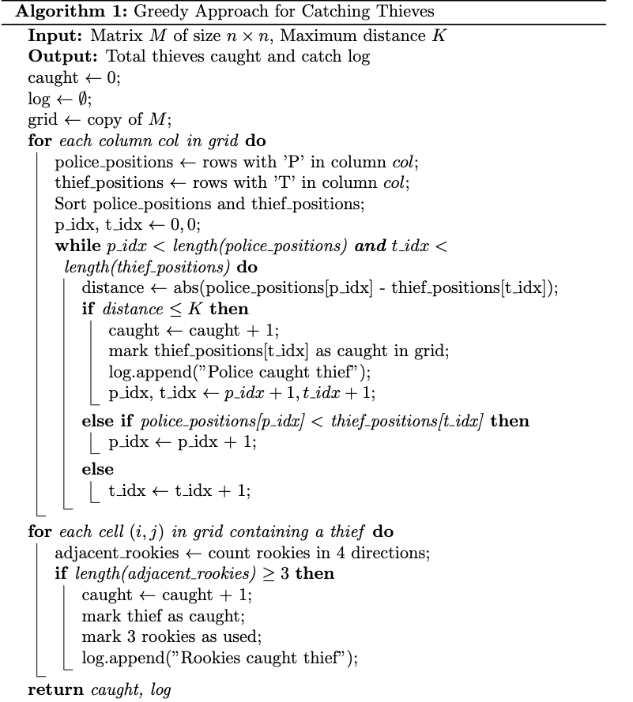
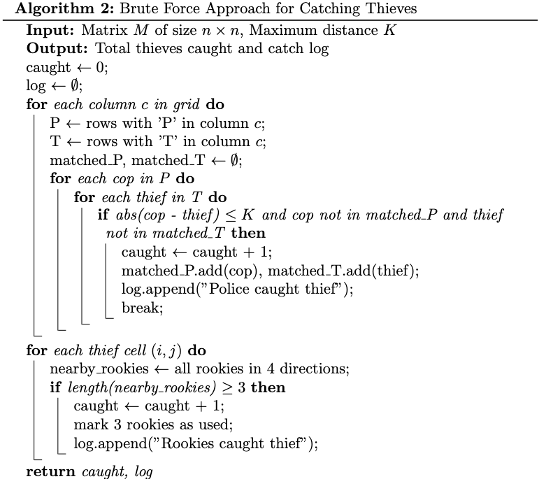
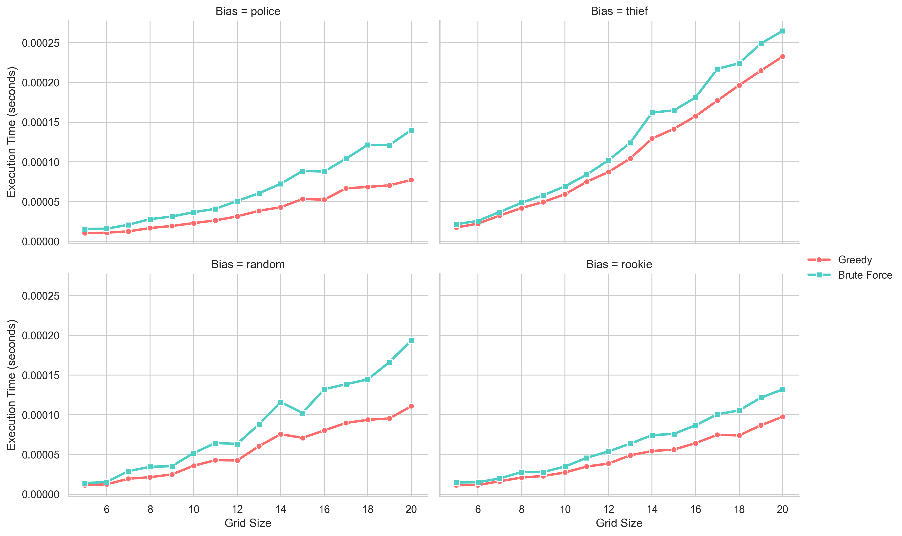
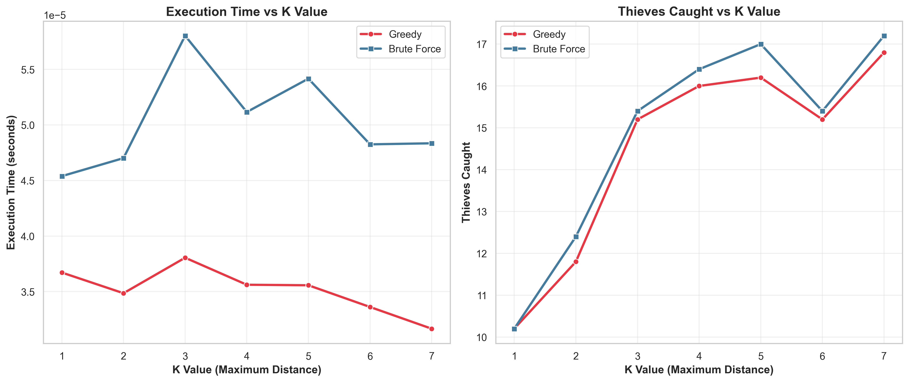
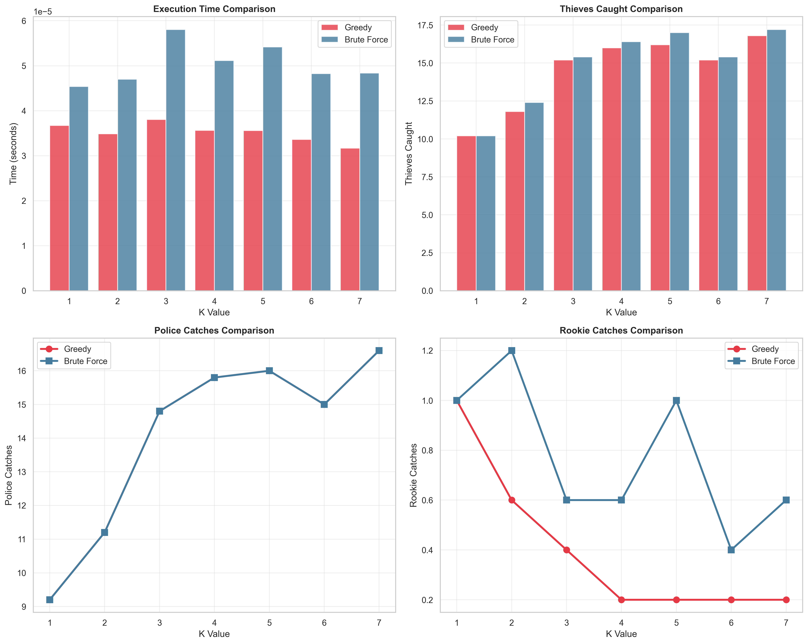

# Modified Policemen Catching Thieves Problem

## Goals
The assignment is to implement and compare the Greedy and Brute Force algorithms for a modified version of the Policemen Catching Thieves problem. Here, policemen (P), thieves (T), and rookies (R) are placed on an N×M grid, with empty cells (X) representing unoccupied spaces. The objective is to maximize the number of thieves caught with the Greedy approach. For the main assignment, I emphasized Modifications 1 and 3 which is policemen catch thieves in the same column, and a set of three adjacent rookies catch a thief. For extra credit, Modification 4 is implemented: setting up a constraint distance K. The experiments for the main assignment operate on grids from 5x5 up to 20x20 with a fixed K value. For the extra credit experiment, the grid size is fixed at 10x10 while K runs from 1 to 7 to observe how it affects the functioning of the algorithm.

### Modifications Implemented
- **Modification 1**: Policemen catch thieves in the same column.  
- **Modification 3**: A set of three adjacent rookies can catch a thief.  
- **Modification 4 (Extra Credit)**: Constraint distance `K` (policemen can only catch thieves within distance `K`).  

**Experiments:**
- Main Assignment: Grids range from `5×5` up to `20×20` with a fixed `K`.  
- Extra Credit: Grid size fixed at `10×10`, with `K` varying from `1 to 7`.  

---

## Greedy Algorithm
The **Greedy algorithm** makes *locally optimal choices* without backtracking.  

- Policemen catch the closest thief in the same column (within distance `K`).  
- Rookies catch a thief only if **three adjacent rookies** are available.  
- Runs in **O(NM log N)** time, efficient but not always globally optimal.  

---

## Brute Force Algorithm
The **Brute Force algorithm** explores *all possible matches* to guarantee the global optimum.  

- Checks all policeman–thief and rookie–thief combinations.  
- Guarantees maximum thieves caught.  
- Very expensive: **O(N²M)** for policeman-thief matching + **O(NM·C(4,3))** for rookies.  

---

##  Program Overview

  
  

---

## Experimental Design

### 1. Balanced vs. Biased Grids (Main Assignment)
- Grids from `5×5` to `20×20`.  
- Scenarios: Police-biased, Empty-biased, Rookie-biased, Balanced.  
- Evaluates both algorithms in terms of **execution time** and **thieves caught**.  
- Modifications 1, 3, and fixed `K` are applied.  

### 2. Varying K-Distance (Extra Credit)
- Balanced `10×10` grids, 25% of each element.  
- Runs with `K = 1 to 7`.  
- Evaluates:  
  - Thieves caught by policemen vs. rookies.  
  - Total thieves caught.  
  - Execution times.  

---

## Results

### 1. Balanced vs Biased (Main Assignment)
- **Execution time:**  
  - Greedy grows steadily (O(NM log N)).  
  - Brute Force spikes sharply (O(N²M)).  

- **Findings:**  
  - Greedy more efficient, especially in police-biased cases.  
  - Brute Force slightly outperforms Greedy in balanced & rookie-biased grids.  

### 2. Varying K (Extra Credit)
- **Execution time:** Decreases slightly as `K` increases (Greedy faster than Brute Force).  
- **Thieves caught:**  
  - Total catches increase with larger `K`.  
  - Policemen dominate catches as `K` grows, rookies get fewer opportunities.  
  - Brute Force consistently catches more thieves overall.  

---

##  Conclusion
- **Greedy Algorithm:**  
  - Efficient (`O(NM log N)`), scales well up to `20×20`.  
  - Locally optimal but may miss global optima in balanced/rookie-biased grids.  

- **Brute Force Algorithm:**  
  - Guarantees maximum thieves caught.  
  - Computationally expensive (`O(N²M)`), impractical for larger grids.  

**Key Insight:**  
Greedy is best for larger grids and police-biased scenarios, while Brute Force serves as a benchmark for smaller grids or research validation.  

